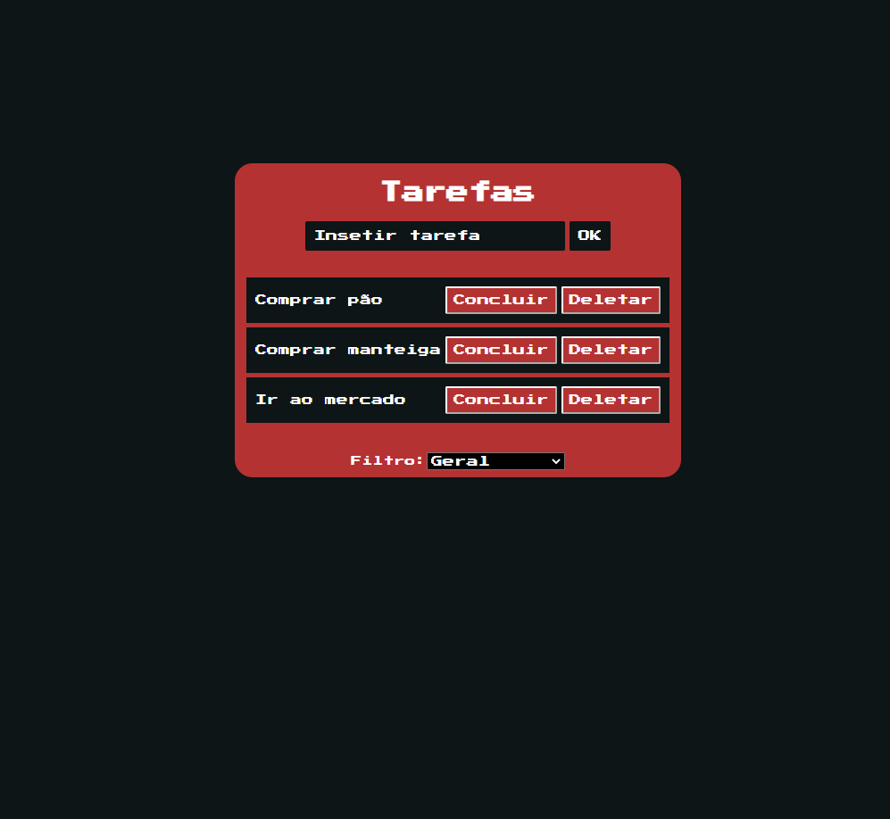

# Projeto
* Desenvolvi uma lista de tarefas com JavaScript puro onde todas as tarefas inseridas são armazenadas no LocalStorage e são renderizadas na página a partir dela, com funções de concluir a tarefa, excluí-la ou filtrar as tarefas de acordo com a sua ação, se foi concluída ou está pendente.

